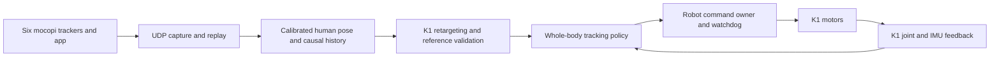

# Mocopi to K1: whole-body controller plan

Planning snapshot: 2026-09-19. This document proposes implementation and acceptance
criteria; it does not report a trained or commissioned controller.

Implementation evidence is maintained separately in
[implementation-status.md](implementation-status.md) and the executable commands
are documented in [controller-runtime.md](controller-runtime.md).

Current constraint: mocopi is unavailable, and the user has no additional capture
data beyond anything recoverable from `k1.zip`. Data preparation, simulation,
teacher/student training, and offline evaluation proceed using the downloaded
human corpus and available archive evidence. Fresh mocopi recordings are not a
prerequisite for starting or completing those development stages.

The requested first usable system follows live whole-body motion, including fast
and dynamic movement, using six mocopi trackers. Standing and slow tracking are
development milestones. The final controller must coordinate the arms, trunk
orientation, balance, feet, and locomotion through one motion-conditioned policy.

The intended experience is: put on the trackers, calibrate, arm, and move. The
user reports that drift was not a practical problem and accepts manual reset or
recalibration approximately every five minutes. Design around these short bouts,
with pause, recenter, and stop controls and clear connection/tracking status.
Preserve the timing and character of movement within an experimentally established
K1 capability envelope. Exact reproduction of every human motion is not assumed.
Long-duration drift correction is a lower priority than tracking quality, contact
handling, latency, and smooth resumption after recalibration.

## What is available

| Item | Evidence reviewed | Implication |
| --- | --- | --- |
| Existing human corpus | `scripts/status.py` and `manifests/corpus-summary.json`: 7,065 tracks, 19.729853 hours; KIT, LAFAN1, and Bandai Namco | Human source data is available; K1 retargeting and physics qualification remain pending. Numerical validation is not behavioral validation. |
| `ACCAD.tar.bz2` | Tar traversal found 252 NPZ files and one text file. One sampled NPZ has finite `poses`, `trans`, `betas`, and `dmpls`; `poses` has 156 columns and its rate is 120 Hz | This appears to be AMASS SMPL+H data. Full inventory, provenance, and numerical validation are still needed. Do not add its hours to the corpus yet. |
| `CMU.tar.bz2` | Zero bytes at inspection | This download is not usable. Existing KIT data already includes CMU-origin recordings, so eventual integration needs source-ID deduplication. |
| `/home/vivi/Downloads/k1.zip` | 720,773,120 bytes; normal ZIP opening fails because the directory/end structure is missing. Local ZIP records allowed 59 selected source/document files to be recovered with verified CRCs | The useful experiments can be reviewed. Archive completeness and a reproducible environment are not established. The original was left intact. |
| Mocopi code | Archived `GMR/general_motion_retargeting/mocopi.py` and `mocopi_ros2/mocopi_ros2/mocopi_receiver.py` | Reuse the packet format, skeleton mapping, and coordinate work with offline fixtures now; confirm the raw live stream when mocopi is available. |
| Archived ROS bags | Two MCAP files and their metadata recovered with ZIP CRC checks; metadata reports 46.650 s and 247.967 s, about 4 min 55 s total | Topics contain upper-body/final joint targets, locomotion commands, state summaries, mode, and low-level status. No raw mocopi UDP or human-skeleton topic is listed. Use as candidate command/interface replay and diagnostic evidence; message contents, motion quality, and physical-versus-simulated state origin still need inspection. |
| Previous controllers | Archived ROS/GMR bridge, HTWK split controller, previews, and experiment notes | Useful interfaces and diagnostics; the split controller is not the requested whole-body imitation architecture. |
| Compute | Local `nvidia-smi`: RTX 5070 Ti, 16,303 MiB. User: H100 allocation with about 46 GB VRAM; laptop RTX 4090 available if needed | Prototype locally; qualify the H100 allocation for headless training. Benchmark deployment on CPU before assigning a GPU. |

The recovered July notes describe a 22-motor K1 with no waist joint and report
past low-state traffic near 483 Hz. Reconfirm this on the actual robot during
commissioning. They also record failed walking evaluations using an MJ dance
policy despite fresh UDP input. Those are historical notes, not tests rerun here.

The old live BeyondMimic integration overlaid selected reference fields while an
offline dance clip supplied other reference terms and a stale-input fallback.
The new runtime needs a complete reference contract and explicit loss handling.

The validated 19.73-hour corpus is enough source material for the initial training
set. The immediate data work is conversion, curation, and physical qualification.
Available log duration does not need to reach a minimum before training starts.

## Architecture and implementation choice

Mocopi already supplies a reconstructed skeleton. Its documented UDP skeleton
has 27 bones; these are not 27 independently measured trackers. Start from this
working output and measure its errors before considering a separate raw-IMU
pose estimator. See [Sony's technical specification](https://www.sony.co.jp/en/Products/mocopi-dev/en/documents/Home/TechSpec.html).

Use these building blocks:

- **Retargeting:** GMR-style constrained IK, the official K1 model, and the
  recovered mocopi adapter. Validate each dataset adapter explicitly.
  [GMR](https://github.com/YanjieZe/GMR) lists K1 support, but that does not establish
  every source-format/K1 combination or this custom mocopi adapter.
- **Training:** start by qualifying the existing Booster K1 Isaac Lab task in
  headless, non-rendering mode on the actual H100 allocation. Reusing its robot
  integration is preferable if it passes. Extend the motion-tracking components
  for a motion library and causal deployment. If the pinned runtime cannot run
  there, assess Isaac Lab's physics-only backends and
  [mjlab/MuJoCo-Warp](https://github.com/mujocolab/mjlab), comparing K1 migration
  effort and measured behavior before selecting a replacement.
- **Learning method:** a TWIST-style teacher and student. The teacher can use
  privileged simulation state and future reference frames during training; the
  deployed student receives current/past commands and deployable robot feedback.
  [TWIST](https://github.com/YanjieZe/TWIST) provides teacher RL and student RL+BC
  training. Its released G1 policy is not a K1 checkpoint.
- **Robot foundation and deployment reference:**
  [Booster assets](https://github.com/BoosterRobotics/booster_assets),
  [Booster train](https://github.com/BoosterRobotics/booster_train), and
  [Booster deploy](https://github.com/BoosterRobotics/booster_deploy).
  Port model, actuator, and interface details carefully; avoid blindly copying
  observation vectors or assuming compatible motion-file schemas.

Physics and policy learning do not inherently require RT cores. NVIDIA's
[Isaac Sim 5.0 requirements](https://docs.isaacsim.omniverse.nvidia.com/5.0.0/installation/requirements.html)
exclude H100 from the supported full application configuration, but this alone
does not establish whether a particular Isaac Lab non-rendering workload runs.
The local `/home/vivi/IsaacLab` checkout identifies as
`v2.2.1-232-gcbf51abb5e`; its `apps/isaaclab.python.headless.kit` still enables
`renderer.enabled = "rtx"` and `app.vulkan = true`. Graphics initialization and
actual rendering are separate concerns, so test the exact runtime.

The newer [Isaac Lab development documentation](https://isaac-sim.github.io/IsaacLab/develop/source/setup/installation/index.html)
provides a Newton/MuJoCo-Warp physics backend without an Isaac Sim dependency.
[NVIDIA's development update](https://github.com/isaac-sim/IsaacLab/discussions/4339)
explicitly connects this separation to H100 support. These are different backend
and version choices from the existing Booster task, and compatibility requires
validation. The [mjlab hardware guidance](https://mujocolab.github.io/mjlab/v1.6.0/source/faq.html)
also includes H100. Lack of RT cores alone does not justify a framework migration.
Use the local RTX machine for visualization and independent physics checks.

## 1. Establish the input and robot contracts

Extract the useful legacy modules into a small maintained package when
implementation begins. Keep packet decoding, calibration, retargeting, policy
inference, and robot communication separable. Preserve upstream attribution.
Use one receiver for the mocopi port and one owner of motor commands.

Implement recording of original UDP bytes alongside source frame numbers, source
timestamps, local monotonic receive timestamps, skeleton definition, and
calibration/session metadata for future use. While mocopi is unavailable, inspect
the recovered ROS messages, replay them at their actual interface layer, and use
dataset-driven replay plus synthetic packet fixtures to develop the input path.
Label synthetic packets and ROS-derived replay explicitly; retargeted robot
commands cannot be treated as original human poses or raw mocopi packets.
Replays of a given input format must share its live preprocessing code.
Reject malformed, incomplete, non-finite, duplicate, and out-of-order frames;
handle app restarts and timestamp/frame-number wraparound explicitly. Keep the
newest complete frame without building a latency-producing backlog.

The archived threaded receiver stores local arrival time and a frame number but
does not retain the source timestamp in its frame object. Its reported frame age
therefore cannot establish sensor-to-robot latency. Preserve both clocks and
measure capture latency separately without subtracting unsynchronized clocks.

Define metres, radians, coordinate handedness, quaternion order, local/global
transforms, named robot joints, and reference/measurement velocity semantics.
Define calibration of neutral pose, scale, facing, and floor. Check conventions
offline using asymmetric left/right motions, turns, squats, and a lifted foot;
confirm them with the user when mocopi is available.

Implement a deliberate recalibration sequence: pause imitation, reach a supported
idle state, recalibrate/recenter, establish the new human-to-robot alignment, then
resume smoothly. Reinitialize reference histories and derivative/filter state
without turning the changed origin into a motion command or a velocity spike.
Keep robot balance/control active through the handover. A five-minute reminder
may prompt a convenient pause; it must not force a reset mid-movement.

**Deliverable now:** a log inventory, deterministic offline replay, synthetic
packet checks, and a side-by-side human/K1 reference viewer. Include the recorder
for later captures. When the trackers return, use a short live validation session
to check the complete input path; no fixed 15–30-minute recording quota blocks
the present work.

## 2. Qualify the simulator and compute

Build one K1 model/configuration contract for training and deployment: body
inertias, joint names and signs, limits, effort/velocity limits, actuator response,
gains, action scaling, control periods, and collision geometry. Check the actual
serial/parallel ankle interface before carrying over the old torque conversion.

Run a small K1 physics and learning preflight locally and on the H100 allocation,
starting with the existing Isaac Lab route and rendering/cameras/video disabled.
Verify the exact Isaac Lab/Isaac Sim versions, CUDA/driver compatibility, actual
GPU partition/profile if applicable, startup, finite states, contacts, actuator
saturation, learner updates, and checkpoint reload. Investigate graphics startup
failures separately from physics or learner failures. For alternate backends,
compare behavior and numeric tolerances; bitwise agreement is not expected.

Measure warmed-up simulation steps/second, learning time, peak VRAM, and contact
buffer overflows with representative dynamic motions. Select parallel environment
counts from these results. A 46 GB allocation does not imply full-H100 compute.

| Machine | Intended role |
| --- | --- |
| RTX 5070 Ti, 16 GB | Retargeting review, interactive simulation, small training runs, local evaluation |
| H100 allocation, about 46 GB | Headless batched physics and teacher/student training after preflight |
| Deployment computer | UDP, retargeting, and compact exported policy; try CPU first and measure p95/p99 timing under load |
| Laptop RTX 4090 | Optional simulation/visualization or inference acceleration if benchmarks justify it |

Keep data and environments on SSD/NVMe, cache parsed motion tensors, and retain
simulator/policy processes across evaluation cases. Reset simulator state,
reference history, filters, calibration, and recurrent state between cases.
Hash essential archives and released model artifacts once; do not repeatedly hash
the raw corpus. Independent CPU conversion workers can run while other clips are
being inspected.

## 3. Build K1 motion references

Use one canonical human representation across mocopi, BVH, MMM, and AMASS. Retain
original timing and source IDs. For the first training/debug set, choose roughly
30–60 diverse clips covering stance, reaching, squats, stepping, turns, fast arm
movement, dance, kicks, and candidate hops. Increase coverage after conversion
and tracking checks are reliable.

ACCAD's sampled 156-dimensional poses plus `dmpls` indicate the SMPL+H route.
GMR's documented AMASS loader requests SMPL-X and explicitly distinguishes it
from SMPL+H. Use the matching licensed SMPL+H body model and an adapter to the
canonical landmarks, or deliberately obtain the matching SMPL-X release.
Do not relabel arrays or discard dimensions to fake compatibility. See
[GMR data preparation](https://github.com/YanjieZe/GMR#data-preparation).

Retarget with joint limits, self-collision checks, temporal continuity, root-height
scaling, and contact-aware feet. Preserve intended single support and flight;
a static support-polygon rule would incorrectly reject dynamic motions. A
kinematically valid reference is still subject to physics and tracking tests.

Store root pose/velocity, named joint positions/velocities, body landmarks,
contact labels and their confidence, source timing, provenance, and rejection
reasons. Root pose describes the reference; it is not an actuated robot joint.
Use one retargeting contract for offline and live data. Any offline lookahead
improvement must not quietly become a required live input.

Create train/validation/test splits by original recording and related takes,
grouping source identities across conversions. Deduplicate CMU-origin overlap
with KIT when CMU is available. Keep mirrored variants and overlapping windows
with their parent recording. Establish held-out evaluation from the downloaded
corpus now. The two archived control bags can support interface regression after
content inspection; their common capture day and limited signals do not establish
generalization across mocopi sessions. Add a separate live mocopi evaluation when
the hardware returns. Report source hours, retargeted hours, and physics-qualified
hours separately.

Clips needing walls, furniture, props, another person, or floor-hand support need
their actual contact setup. Label them separately from the initial flat-ground
set. Preserve existing dataset licenses and attribution for derived artifacts.

## 4. Train a universal tracker and causal student

Train a motion-conditioned whole-body teacher across the selected K1 references.
Balance sampling across motion families; use failures to focus sampling without
letting a few impossible references dominate training. Expand the library in a
curriculum that explicitly includes fast movement and changing support contacts.
Include starts, stops, and feasible transitions as well as motion interiors.

Train the student on states it actually visits, using teacher supervision plus
task reward. Start with a compact history-based network or recurrent policy.
Candidate observations are robot joint positions/velocities, projected gravity,
angular velocity, previous actions, current/past retargeted commands, reference
heading/height and local displacement/velocity, frame age, and validity masks.
Any estimated robot velocity must use an estimator available at deployment.

Keep simulator-only position/contact truth and future motion out of the actor.
They can inform the teacher, critic, and training rewards. Use the same observation
builder and normalization for simulation deployment and robot deployment.

Start teacher and causal-student training with the downloaded motion references.
Add modest, explicit engineering assumptions for scale/pose errors, foot sliding,
timing jitter, delay, and packet loss, along with pause/resume and recalibration
events. Use the archived logs to constrain only properties they actually record;
ROS publication timing does not establish mocopi capture latency or UDP loss.
Label unmeasured corruption ranges as assumptions and compare against a clean
input baseline. Refine them after later live checks.

Given the user's experience and five-minute recalibration cadence, a dedicated
drift estimator or long-horizon drift dataset is not a development prerequisite.
Do not let speculative large drift dominate training. Perfect virtual six-point
poses still do not reproduce six IMUs or Sony's pose reconstruction; synthetic
robustness tests cannot establish actual mocopi tracking quality.

Favor relative body pose and local motion over accumulating absolute human x/y
error. Provide a controlled recenter operation. Exact global trajectory tracking
would additionally require dependable localization and is a separate capability.

The actor should produce bounded joint targets/residuals through a validated K1
actuator model. It controls all joints jointly and can make balance corrections.
Keep reference tracking, action smoothness, effort, contacts, and recovery from
small disturbances visible as separate metrics.

**Deliverable:** one K1 policy following unseen references without per-clip
checkpoint switching. Teacher-only replay success does not complete this stage.

## 5. Validate offline now and the live path when available

First run held-out human motions through the canonical conversion, retargeter,
and exported actor in closed-loop simulation at streaming speed. Replay usable
archived ROS messages at their recorded layer, and use synthetic UDP fixtures
for decoder/transport fault cases. Report these separately so success at a
downstream interface does not imply the original mocopi input path was tested.
Arbitrary input changes must not depend on knowing the rest of a recording.

When mocopi is available, test the full live receiver-to-controller path and
capture useful examples opportunistically. Check fast/dynamic movements,
latency, pause/recalibration/resume, and disconnection. This is a later live
acceptance step; it does not block offline preparation or training now.

Use a fixed evaluation panel with held-out recordings, motion transitions,
dynamic categories, different calibrations, and impaired network cases. Report
completion without resets, falls, body/foot tracking error, contact slip,
self-collisions, effort/velocity saturation, and latency by motion family.
Resetting after a fall counts as a failed trial. A planned five-minute calibration
pause is an allowed operating event, recorded separately from falls or faults.
Recalibration changes the input alignment; it does not reset the simulated or
physical robot to conceal a failed tracking episode.

Add a causality check: two input streams with the same prefix and different
future frames must produce the same commands up to the differing input, from
the same robot state. Check that no offline clip contributes hidden reference
terms or begins playing when input goes stale.

Initial engineering targets, to be revised openly after measurements:

- 50 Hz policy/reference update as a starting point; match training and runtime
  timing. Motor communication runs at the separately verified K1 interface rate.
- Received-frame-to-command latency below 40 ms at p95, with no sustained queue
  growth, measured on replay now. Measure physical motion-to-robot response once
  mocopi and the robot are available; aim for p95 below 150 ms before calling the
  live controller responsive. Offline logs alone cannot establish this number.
- A held-out panel spanning at least eight motion families, with at least 20
  trials per family. Provisional target: at least 95% completion in each family,
  including the selected dynamic families; report failures rather than averaging
  them away. This simulation target alone does not authorize dynamic hardware use.
- Two successive five-minute simulated control bouts, including an explicit
  pause/recalibration/resume between them, without a fall, unexplained robot-state
  reset, or loss of command ownership. Also test stale-input/reconnect cases.

Freeze motion-specific tracking and actuator thresholds before evaluating a
candidate. Fast movement may require bounded lag or amplitude reduction; measure
that tradeoff instead of hiding it with heavy filtering. Exact, immediate imitation
of every unexpected dynamic motion is not a realistic acceptance criterion.

## 6. Commission the robot and establish dynamic capability

First verify the SDK/firmware, read-only state, joint order/signs, ankle mapping,
control periods, and supported mode transitions. Then test restrained actuator
response and standing tracking, followed by stepping, turns, and progressively
more dynamic motions. Keep one motor-command owner and an independent operator
stop throughout commissioning.

Input loss should trigger a validated transition toward supported idle when the
robot state permits. Mid-step or airborne interruption needs different handling
from standing; freezing arbitrary joint targets is not a universal fallback.
Connect and verify vendor fall/state signals. A fault must not cause an automatic
restart of imitation or an unrelated prerecorded motion.

For the first usable release, require live whole-body sequences containing the
agreed fast/dynamic motion families on the real K1, repeatable calibration,
measured latency, and demonstrated loss/reconnect behavior within the accepted
roughly five-minute bouts. Confirm that recalibration and resumption introduce no
command jump. These release checks wait for mocopi access, while offline model
development proceeds immediately. Publish a capability
matrix for tested movement amplitudes and speeds. Kicks, hops, and rapid turns
enter that matrix only after their individual results support them.

## First implementation milestone

Build the recorder/replay and canonical pose viewer while qualifying the existing
Booster K1 Isaac Lab task locally. Run its non-rendering preflight on the H100
allocation when accessible, and select the training runtime from that evidence.
These produce an inventory of usable archived signals, a small reviewed K1
reference set from the downloaded corpus, a working offline replay path, and a
measured training baseline before a long run. Proceed even if the archive contains
no useful mocopi-derived movement; new captures are not on this critical path.

Open implementation facts are the H100 access/runtime/profile, installed K1
firmware and compute, available body-model files, and reproducibility of the
archived hardware interfaces. Actual mocopi output timing and live sensor-to-robot
behavior remain later validation items until the trackers return. The overall
architecture does not depend on having an existing working walking controller.

## Inspection trail

Reviewed existing repository files: `README.md`, `scripts/status.py`,
`manifests/corpus-summary.json`, `manifests/sources.json`, and
`manifests/reference-assets.json`.

Relevant ZIP members include `k1/docs/k1_system_learnings.md`,
`k1/docs/mocopi_k1_ros2_gmr_teleop.md`, `k1/mocopi_ros2/README.md`,
`k1/GMR/general_motion_retargeting/mocopi.py`,
`k1/GMR/general_motion_retargeting/ik_configs/mocopi_to_k1.json`, and
`k1/mocopi_ros2/mocopi_ros2/k1_htwk_lowlevel_controller.py`.
The reviewed files and per-member CRC receipt were staged in
`/tmp/k1-plan-review-07aass6a/`; this is temporary inspection output, not the
project's permanent source layout.

Also recovered `k1/rosbags/k1_20260719_145014/` and
`k1/rosbags/k1_20260719_150836/`: the two MCAP files and their metadata passed ZIP
CRC checks, and both MCAP files have their opening/closing format markers. The
metadata reports 32,954 and 77,707 messages respectively. Payload decoding and
motion-quality review have not been performed. The temporary recovery receipt
is `/tmp/k1-plan-review-07aass6a/rosbag-recovery-receipt.json`.
