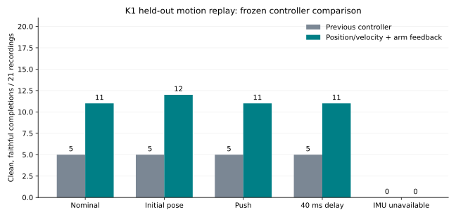

# K1 controller recovery experiments — 20 September 2026

The selected position/velocity controller increased clean, faithful full-motion completions from **5/32 to 16/32**. On the 21 capture groups reserved for confirmation, it improved **5/21 to 11/21**. Raw completion changed from 20/32 to 19/32, while trials with self-collision decreased from 24/32 to 7/32. There were 11 newly passing originals and 0 lost passes; their IDs are in the JSON/CSV. All baseline artifacts remain available. These are selected development motions, not a corpus-wide success-rate estimate or final behavioral acceptance.

## Implemented controller

- K1 canonical 22-joint position and velocity commands, 50 Hz control and 500 Hz torque integration. Position slew remains at most 6 rad/s and all physical joint, velocity and effort limits remain enforced.
- The native servo computes `Kp * (q_target - q) + Kd * (v_target - v)`, followed by effort clipping. The selected profile uses 25% reference-velocity feedforward. The target velocities originate in the causal K1 retargeter, not raw human joint velocities.
- Existing checkpoint-2500 learned joint/IMU feedback supplies the leg corrections and double-support ankle balance prior. Its weights are unchanged. The selected arm residual scale is zero; arms follow retargeted positions/velocities plus bounded geometric correction.
- Forearm collision feedback uses measured joint positions/velocities and a private K1 geometry model. It anticipates closing motion over 40 ms, requests 25 mm clearance when geometrically movable, and limits corrections to 0.15 rad before the ordinary command slew limit. Head and leg targets cannot be changed by this correction. The physics model and collision detector remain unmodified.
- Held/stale input stops velocity feedforward after 40 ms. Pause/fault/stop cannot retain a moving velocity command. Training, native replay, GPU MuJoCo and the Isaac command path share the position/velocity contract. Native and GPU MuJoCo were dynamically tested; Isaac's modified path was not behaviorally requalified in this experiment.

Profile: [`controller-pv-arm-feedback-v1.json`](../configs/controller-pv-arm-feedback-v1.json). Export: `artifacts/controller-pv-arm-feedback-v1/actor.pt` plus its bound metadata. Legacy exports keep their original action settings. The selected profile remains hardware-unverified and behaviorally unaccepted against the full project target.

## What the experiments established

There are **627 saved motion replays across 46 controller/condition labels**, using 32 distinct original recordings. Repeats and mirrors are not new demonstrations. We used 11 recordings for development and reserved 21 other capture groups for confirmation. The parameter choice was frozen before confirmation. Three PPO trials used a separate, frozen 40-original simulation-candidate pool; confirmation capture groups and related take-name prefixes were excluded, and original dataset split labels were retained. Recovery quality and source families were inherited from the prior recovery experiment; labels such as `bow` can include bow-saw work, so they are not a substitute for semantic review.

- **Bare position PD:** 0/11 completions. Adding full reference-velocity feedforward alone also completed 0/11.
- **Existing learned balance policy:** 8/11 completions on development, but many arm/hip collisions. Removing IMU feedback caused 0/21 completions for both baseline and selected controller on confirmation.
- **Full velocity feedforward into the old policy:** regressed completion. Differentiating the entire corrected command was worse and could amplify feedback changes. With the same final arm correction, position-only control gave 4/11 faithful clean passes, 25% feedforward gave 5/11, and full feedforward gave 2/11.
- **Stronger gains:** did not solve balance; 4x arm stiffness regressed the early development configuration to 3/11 completions and zero pose/collision passes.
- **Naive collision projection:** near-fixed joint housings generated nearly singular constraints and enormous proposed corrections. Clipping concealed the bad proposal but could still disturb leg balance. This version was discarded. The adopted version restricts correction to movable arm coordinates, ignores weak constraint directions, and bounds the correction.
- **Arm gravity compensation:** did not beat the selected controller.
- **Small PPO continuations:** three matched 120-iteration, 512-environment trials (1,966,080 transitions each; 5,898,240 total) with position-only, partial-velocity and full-velocity contracts did not beat the selected controller on development. This is a bounded negative result, not evidence that longer or better-targeted training cannot help. Their checkpoints and frozen source receipts are retained.

## False positives found by the final audit

The initial pose/balance/collision gate reported 18/32 passes for the selected controller. Two were wrong for the intended motion: a run moved at about 0.37 m/s while its reference averaged 1.08 m/s, and a carrying walk achieved only 16% of the requested forward progress. These are **rejected** in the final 16/32 figure. One baseline pass was also rejected, changing its count from 6 to 5.

The new audit retains the previous pose, slip, effort, collision and timing checks and adds root-velocity RMS error at most 0.3 m/s, mean/max root-orientation error at most 0.35/1.0 rad, and 70–130% progress along the requested direction when the reference's net horizontal travel is at least 0.5 m. Small positional drift remains separate from missing locomotion. These explicit development thresholds are saved with every run. Evaluation-only root state never enters the deployed actor.

A second issue was endpoint-only collision measurement in older evaluation paths. They now include any self-contact detected during the 500 Hz integration interval, refresh forward kinematics, and include measured joint-speed violations. Relative-body RMS is measured as Euclidean landmark distance. The original historical reports retain their original measurement semantics.

## Stress tests with the final fidelity gate

| Condition | Previous controller | Selected controller |
|---|---:|---:|
| Nominal | 5/21 | 11/21 |
| Initial pose | 5/21 | 12/21 |
| Push | 5/21 | 11/21 |
| 40 ms delay | 5/21 | 11/21 |
| IMU unavailable | 0/21 | 0/21 |

Each row uses the same 21 confirmation recordings. Initial-pose perturbations used up to 0.015 rad joint noise and 0.04 rad roll/pitch; a ground adjustment only removed initial penetration. Pushes applied 10 N forward and 5 N lateral for 0.1 s. The delay condition used two control ticks. IMU removal is a diagnostic ablation, not a supported operating mode. These are engineering test conditions, not measured mocopi noise models.

The selected controller also completed two uninterrupted **300-second standing bouts**, with an explicit pause, recalibration and resume between them, without teleporting or resetting after falls. This supports standing/handover behavior, not universal dynamic motion.

## Per-family development counts

| Source family label | Originals | Previous clean | Selected clean |
|---|---:|---:|---:|
| bow | 3 | 0 | 2 |
| dance | 1 | 0 | 0 |
| fall_or_recovery | 1 | 0 | 0 |
| gesture | 6 | 0 | 5 |
| idle_stance | 2 | 1 | 1 |
| jump | 1 | 0 | 0 |
| kick | 1 | 0 | 0 |
| object_interaction | 2 | 1 | 1 |
| other | 2 | 1 | 2 |
| punch | 1 | 1 | 1 |
| run | 3 | 0 | 0 |
| sit_or_kneel | 2 | 1 | 1 |
| squat | 1 | 0 | 0 |
| transition | 1 | 0 | 0 |
| turn | 4 | 0 | 2 |
| walk | 1 | 0 | 1 |

Remaining failures include dynamic leg/foot balance, insufficient locomotion speed, and ground-supported motion. Deliberate fall/kneel motions need an appropriate contact/task definition; the current upright-height gate is retained rather than quietly relaxed. Object-interaction labels here mean unloaded motion replay, not successful physical object interaction.

## Run updates and validation

- New resumable follower: `scripts/validate_recovered_controller.py`. It consumes accepted V4 recovery originals, caches the policy per worker, saves complete traces, keeps mirrors separate, and records raw completion, collision, faithful clean success and execution errors separately.
- The initial audit V1 was stopped and preserved after the false positives were found. **V2** binds the stricter motion-fidelity criteria, frozen source revision, actor and metadata hashes, and upstream recovery contract. Its live receipt is `reports/controller-recovery-live-20260920.json`.
- Per-reference replay results remain explicitly controller-specific. `physics_qualified` and general `training_eligible` are not automatically promoted from one replay; full per-family robustness and hardware qualification remain outstanding.
- Simulation training can now explicitly admit audited candidates through `--candidate-training`; this does not relabel them physics-qualified or allow test recordings into the training split.
- Native/GPU MuJoCo parity passed for both legacy and nonzero-velocity actuation, with maximum tested joint-position discrepancy below 5e-7 rad and velocity discrepancy below 7.4e-5 rad/s. Partial-reset isolation, self-contact detection and overflow checks passed. The full suite passed **59 tests**; evidence is in `artifacts/controller-lab-20260920/fidelity-tests.log`, including causality, stale-input, damping, arm-clearance and false-locomotion regression checks.
- Both original V3 conversion shards finished: 142,220 rows covering 71,132 originals and 71,088 mirrored augmentations. Their original kinematic gate accepted 46,615 originals; the stricter V4 recovery audit is still running and can withhold those acceptances. The recovery geometry code remains pinned, and its hashes were checked before the controller audit.
- At 15:34 JST one local V4 worker segfaulted, causing its process pool to stop; the controller audit then stopped because its upstream was incomplete. The complete ledgers were preserved and both jobs resumed without changing source, controller or thresholds. Recovery and replay counters advanced after resuming. Crash diagnostics and at most three starts per hour are now configured; the underlying native crash is not yet explained. The incident, logs and pre-resume summaries are retained under `artifacts/controller-lab-20260920/recovery-worker-incident-153428/`. The controller audit currently covers the local shard; remote V4 recovery continues separately.

## Research used

[BeyondMimic, section III-C](https://arxiv.org/html/2508.08241v1#S3.SS3) supports using a learned whole-body tracker with moderate PD impedance rather than assuming that very high stiffness solves tracking. We tested this on the local K1 model rather than copying its robot-specific gains.

[Booster's JointCommand reference](https://docs.booster.tech/docs/developer-guide/booster-os-python-sdk/common-data-types/joint-related-data/joint-command/) exposes position, velocity, feedforward effort and explicit gains. The repository's physical parallel-ankle mapping and actuator dynamics remain unverified; the current results are for the canonical serial K1 simulation model.

Saved evidence: [machine-readable report](controller-recovery-experiments-20260920.json), [paired trial CSV](controller-recovery-20260920/paired-trials.csv), source snapshots and trial traces under `artifacts/controller-lab-20260920/`.
